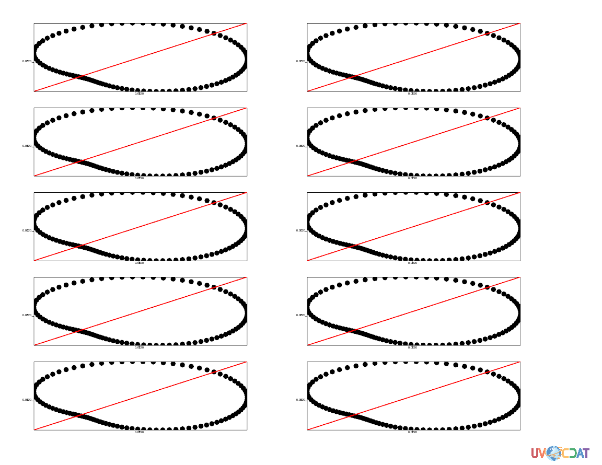
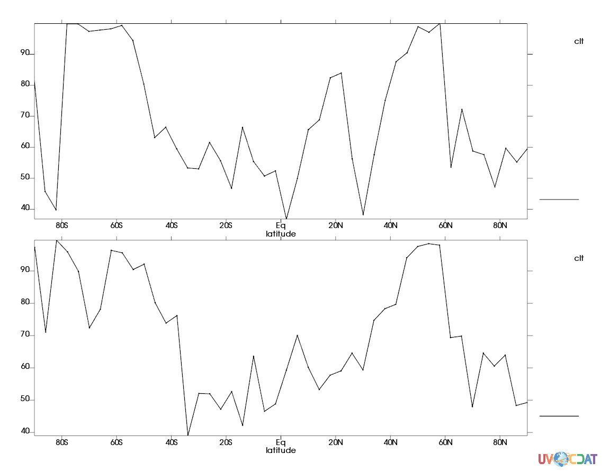
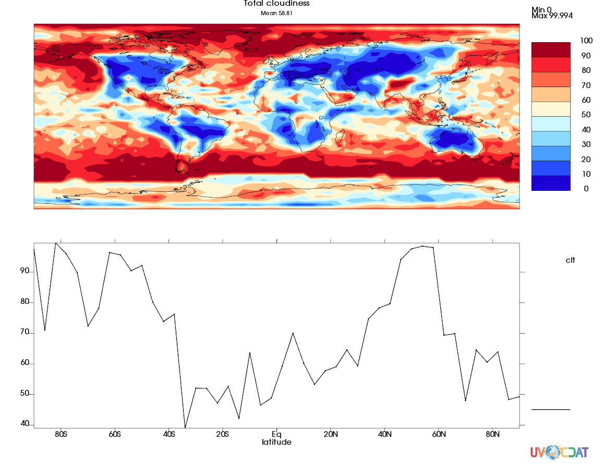
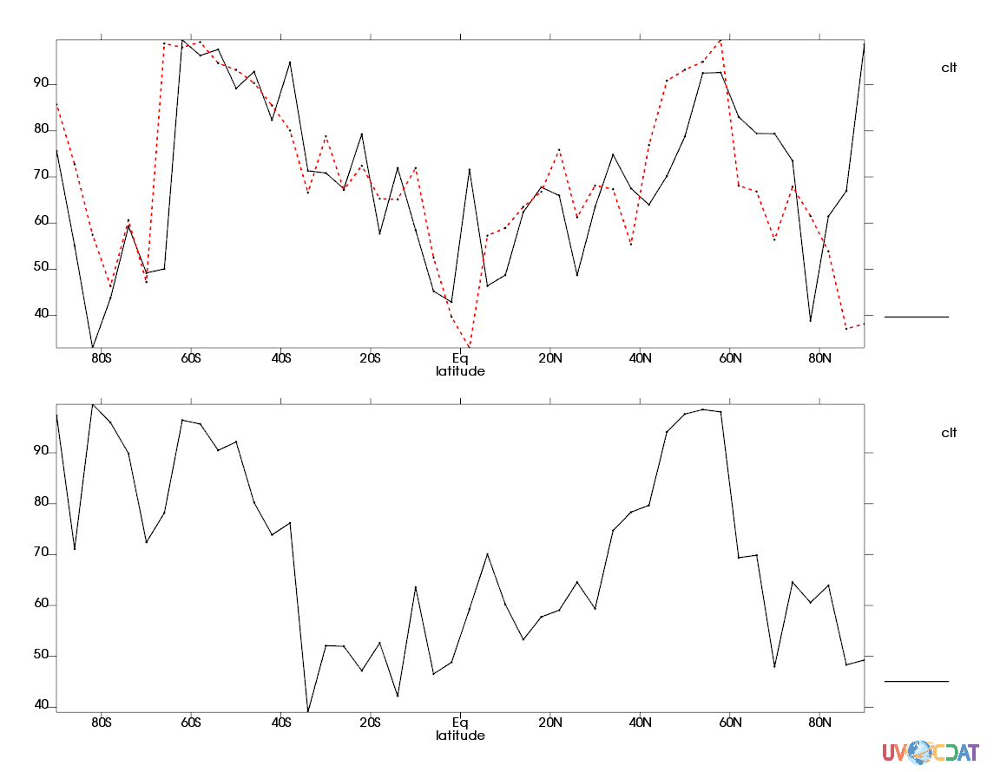

##  Template Factory Documentation
###  Introduction

Template Factory is a set of classes and functions designed to help users to create multi-plot (more than a plot on a page) templates that will be used mainly in diagnostics package of UVCDAT. Instead of creating different templates for different plot configurations, Template Factory generates the templates automatically and places the plot options in the correct positions.  

Template Factory is easy to use. It consists basically of 2 steps process:

* Instantiation of a Template Options object, a list of strings with the plots graphic methods and a list defining the presence of plots overlays.
* Execution of main function and returning of the VCS graphic objects and templates.
    
In the examples here the page plot geometry (number of plots per page) is defined during the exemples execution, allowing the user to better understand the Template Factory capabilities.

###  Template Options
####  Definitions

The Template Factory was built to be used as part of the diagnostics package. Because of that, the plot options displayed (title, legend, x tics, y tics, etc.) were enabled or disabled follwing pre-definitions and their final position on the generated templates already determined. It means that if a template property (plot option) not pre-defined in the original diagnostic template must be used, it will not be automatically placed on the page and some manual intervention must be done as a common VCS template.

There are basically 4 types of pre-defined template properties (plot options). They are all specializations of the class TemplateOption, which all template properties are turned on by initialization.

     from metrics.frontend.templateoptions import *

     templateOptions = TemplateOptions()

     # Disabling the title:
     templateOptions.title = False
 
The specializations of TemplateOptions class are: TemplateOptionsUVWGMulti (used for isofill, vector, boxfill and isoline plot methods), TemplateOptionsUVWGMultiScatter (used for scatter graphic method), TemplateOptionsUVWG1DMulti (used for 1D plots, the yxvsx graphic method), and the main template option, the TemplateOptionsUVWG class. The TemplateOptionsUVWG class is used to align multiple plots generated by different graphic methods on a same page. This special plot method is needed because some methods enable specific options that others don't, but these specific options must be considered when aligning the plot's options inside the page.

Finally, all specializations of TemplateOptions also have their only data version: TemplateOptionsUVWGDUDMulti, TemplateOptionsUVWGDUDMultiScatter and TemplateOptionsUVWG1DDUDMulti; where only the template data is enabled.

In order to use the Template Factor one must call its main function:

    def build_templates(canvas=None, graphicMethodStrings=None, overlay=None, rows=1, columns=1,
                        mainTemplateOptions=None, templateOptionsArray=None, templateNameArray=None,
                        legendDirection='vertical', forceAspectRatio=False, onlyData=False):

The arguments of the main function are:

* canvas: a VCS canvas
* graphicMethodStrings: a python list with the graphic methods to be used in the plots, ordered by the top-left row-column to the bottom-righ row-column. E.g.: [ísofill', 'vector']
* overlay: a python list of 0's and 1's, indicating if the plot defined in graphicsMethodStrings is an overlay plot. E.g.: [0, 1, 0] (3 plots, the second one is overlayed over the first one)
* rows: number of rows
* columns: number of columns
* mainTemplateOptions: the template options that will define the main alignment. E.g. TemplateOptionsUVWG()
* templateOptionsArray: python list of template options to be applied for the plots on a page. It follows the same orientation fo the graphicMethodStrings.
* legendDirection: python string, 'vertival' or 'horizontal'. (Only 'vertical' working now.)
* forceAspectRation: python boolean, it enables the 2:1 aspect ration for the plots in a page.

The main function returns two python lists, the VCS' graphic methods and the templates to be used by the VCS' plot method.

##  Examples

In this example we simply plot 2 columns and 3 rows using VCS' isofill graphic method (the TemplateOptionsUVWGMulti class can also be used to plot with the following methods: vector, isoline and boxfill)

    import sys
    import numpy
    import EzTemplate, vcs
    from metrics.frontend.it import * 
    from metrics.frontend.templateoptions import *
    from metrics.frontend.templatefactory import *
    
    cdmsfile = cdms2.open('clt.nc')
    canvas = vcs.init()
    canvas.setcolormap('bl_to_darkred')

    rows = int(raw_input("Enter the number of rows: "))
    columns = int(raw_input("Enter the number of columns: "))

    if rows == 0 or columns == 0:
        print "Invalid value entered."
        exit(0)
    
    data = []
    for i in range(rows*columns):
        data.append(cdmsfile('clt', time=slice(7,8), longitude=(-180, 180),
                             latitude = (-90., 90.), squeeze=1))
    # Defines template display of options:
    templateOptionsUVWG_Multi_Isofill = TemplateOptionsUVWGMulti()

    graphicMethodStrings = []
    overlay = []
    for i in range(rows*columns):
        graphicMethodStrings.append('isofill')
        overlay.append(0)

    graphicMethodObjects, templates = build_templates(canvas, graphicMethodStrings, overlay, rows, columns,
                                                      templateOptionsUVWG_Multi_Isofill)
    
    if templates is None:
        print "Empty template list."
        exit(0)
    elif graphicMethodObjects is None:
        print "Empty graphic method objects list."

    canvas.clear()
    
    # Plotting
    for i in range(rows*columns):
        canvas.plot(data[i], graphicMethodObjects[i], templates[i])

    # Saves plot to disk
    canvas.png('Automatic-Isofill-EzTemplate.png', ignore_alpha=1)
    raw_input('Done')

In this example we plot 2 columns and 5 rows using the VCS' scatter graphic method. This is an interesting example because we can observe the correct use of the overlay list (0 if the current plot is not an overlay plot, 1 otherwise) and the use of the an array (python list) of template options (templateOptionsArray in the example below). We use the template options array when different plots on a page are using different template options. The first template option is the main template, all labeling, title, etc  will be placed based on its enabled options.

    import sys
    import numpy
    import EzTemplate, vcs
    from metrics.frontend.it import * 
    from metrics.frontend.templateoptions import *
    from metrics.frontend.templatefactory import *

    cdmsfile = cdms2.open('clt.nc')
    canvas = vcs.init()
    canvas.setcolormap('bl_to_darkred')

    rows = int(raw_input("Enter the number of rows: "))
    columns = int(raw_input("Enter the number of columns: "))

    if rows == 0 or columns == 0:
        print "Invalid value entered."
        exit(0)
    
    data = []
    data.append(cdmsfile('u'))
    data.append(cdmsfile('v'))
    data.append(np.arange(10))
    data.append(2*(np.arange(10)))
    
    # Template Options
    templateOptionsUVWG_Multi_Scatter     = TemplateOptionsUVWGMultiScatter()
    templateOptionsUVWG_DUD_Multi_Scatter = TemplateOptionsUVWGDUDMultiScatter()

    templateOptionsArray = []
    graphicMethodStrings = []
    overlay = []
    for i in range(2*rows*columns):
        graphicMethodStrings.append('scatter')
        if i % 2 == 0:
            overlay.append(0)
            templateOptionsArray.append(templateOptionsUVWG_Multi_Scatter)
        else:
            overlay.append(1)
            templateOptionsArray.append(templateOptionsUVWG_DUD_Multi_Scatter)

    
    graphicMethodObjects, templates = build_templates(canvas, graphicMethodStrings, overlay, rows, columns,
                                                      templateOptionsUVWG_Multi_Scatter, templateOptionsArray)

    if templates is None:
        print "Empty template list."
        exit(0)
    elif graphicMethodObjects is None:
        print "Empty graphic method objects list."
        
    canvas.clear()

    for i in range(2*rows*columns):
        if overlay[i]:
            canvas.plot(data[2], data[3], graphicMethodObjects[i], templates[i])
        else:
            canvas.plot(data[0], data[1], graphicMethodObjects[i], templates[i])

    # Saves plot to disk
    canvas.png('Automatic-Scatter-EzTemplate.png', ignore_alpha=1)
    # Saves the plot preview on disk
    raw_input('Done')

In this example we plot 1 columns and 2 rows using the VCS' yxvsx (1D plots) graphic method.

    import sys
    import numpy
    import EzTemplate, vcs
    from metrics.frontend.it import * 
    from metrics.frontend.templateoptions import *
    from metrics.frontend.templatefactory import *
    
    cdmsfile = cdms2.open('clt.nc')
    canvas = vcs.init()
    canvas.setcolormap('bl_to_darkred')
    # canvas.portrait()

    rows = int(raw_input("Enter the number of rows: "))
    columns = int(raw_input("Enter the number of columns: "))

    if rows == 0 or columns == 0:
        print "Invalid value entered."
        exit(0)
    
    data = []
    for i in range(rows*columns):
        if i%2 == 0:
                data.append(cdmsfile('clt', time=slice(1,2), longitude=(-180, -180),
                                     latitude=(-90., 90.), squeeze=1))
        else:
            data.append(cdmsfile('clt', time=slice(35,36), longitude=(-180, -180),
                                 latitude=(-90., 90.), squeeze=1))
            
    # Template Options
    templateOptionsUVWG_1D_Multi = TemplateOptionsUVWG1DMulti()
 
    graphicMethodStrings = []
    overlay1 = []
    for i in range(rows*columns):
        graphicMethodStrings.append('yxvsx')
        overlay1.append(0)

    graphicMethodObjects, templates = build_templates(canvas, graphicMethodStrings, overlay1, rows, columns,
                                                      templateOptionsUVWG_1D_Multi)    

    if templates is None:
        print "Empty template list."
        exit(0)
    elif graphicMethodObjects is None:
        print "Empty graphic method objects list."
   
    canvas.clear()
         
    # Plotting
    for i in range(rows*columns):
        canvas.plot(data[i], graphicMethodObjects[i], templates[i])            
        
    # Saves plot to disk
    canvas.png('Automatic-1D-EzTemplate.png', ignore_alpha=1)
    raw_input('Done')
  
  

In this example we plot 2 columns and 2 rows using the VCS' isofill plus the vector graphic methods. This is also an interesting example because we can observe the correct use of the overlay list (0 if the current plot is not an overlay plot, 1 otherwise), the use of the an array (python list) of template options (templateOptionsArray in the example below) and the use of different VCS graphic methods. We can see from the example below, the vector plots are drawn over the isofill plot (the vector graphic methods has overlay equals 1 in the overlay array (python list)).

    import sys
    import numpy
    import EzTemplate, vcs
    from metrics.frontend.it import * 
    from metrics.frontend.templateoptions import *
    from metrics.frontend.templatefactory import *

    cdmsfile = cdms2.open('clt.nc')
    canvas = vcs.init()
    canvas.setcolormap('bl_to_darkred')

    rows = int(raw_input("Enter the number of rows: "))
    columns = int(raw_input("Enter the number of columns: "))

    if rows == 0 or columns == 0:
        print "Invalid value entered."
        exit(0)
    
    data = []
    for i in range(rows*columns):
        data.append(cdmsfile('clt', time=slice(7,8), longitude=(-180, 180),
                             latitude = (-90., 90.), squeeze=1))

    data.append( cdmsfile('u') )
    data.append( cdmsfile('v') )

    # Template Options:
    templateOptionsUVWG_Multi_Isofill = TemplateOptionsUVWGMulti()
    templateOptionsUVWG_DUD_Multi     = TemplateOptionsUVWGDUDMulti()

    templateOptionsArray = []
    graphicMethodStrings = []
    overlay = []
    for i in range(2*rows*columns):
        if i % 2 == 0:
            graphicMethodStrings.append('isofill')
            overlay.append(0)
            templateOptionsArray.append(templateOptionsUVWG_Multi_Isofill)
        else:
            graphicMethodStrings.append('vector')
            overlay.append(1)
            templateOptionsArray.append(templateOptionsUVWG_DUD_Multi)

    graphicMethodObjects, templates = build_templates(canvas, graphicMethodStrings, overlay, rows, columns,
                                                      templateOptionsUVWG_Multi_Isofill, templateOptionsArray)
    
    if templates is None:
        print "Empty template list."
        exit(0)
    elif graphicMethodObjects is None:
        print "Empty graphic method objects list."

    canvas.clear()
    
    # Plotting
    for i in range(2*rows*columns):
        if overlay[i] == 0:
            canvas.plot(data[i/2], graphicMethodObjects[i], templates[i])
        else:
            canvas.plot(data[rows*columns], data[rows*columns + 1], graphicMethodObjects[i], templates[i])

    # Saves plot to disk
    canvas.png('Automatic-Isofill-EzTemplate.png', ignore_alpha=1)
    raw_input('Done')
    
 
In the following example we plot two different types of graphic methods on the same page:

    import sys
    import numpy
    import EzTemplate, vcs
    from metrics.frontend.it import * 
    from metrics.frontend.templateoptions import *
    from metrics.frontend.templatefactory import *

    cdmsfile = cdms2.open('clt.nc')
    canvas = vcs.init()
    canvas.setcolormap('bl_to_darkred')

    rows    = 2
    columns = 1

    # Defines template display of options:
    templateOptionsUVWG_Multi_Isofill = TemplateOptionsUVWGMulti()
    templateOptionsUVWG_1D_Multi = TemplateOptionsUVWG1DMulti()

    templateOptionsArray = []
    graphicMethodStrings = []
    overlay              = []
    data                 = []
    
    for i in range(rows*columns):
        if i%2 == 0:
            data.append(cdmsfile('clt', time=slice(7,8), longitude=(-180, 180),
                             latitude = (-90., 90.), squeeze=1))
            graphicMethodStrings.append('isofill')
            templateOptionsArray.append(templateOptionsUVWG_Multi_Isofill)
        else:
            data.append(cdmsfile('clt', time=slice(35,36), longitude=(-180, -180),
                                 latitude=(-90., 90.), squeeze=1))
            graphicMethodStrings.append('yxvsx')
            templateOptionsArray.append(templateOptionsUVWG_1D_Multi)

        overlay.append(0)

    # Generates the graphics objects and the templates:
    graphicMethodObjects, templates = build_templates(canvas, graphicMethodStrings, overlay, rows, columns,
                                                      TemplateOptionsUVWG(), templateOptionsArray)

    print "Size of graphicsMethodObjects: {0}, templates = {1}".format(len(graphicMethodObjects), len(templates))
    
    if templates is None:
        print "Empty template list."
        exit(0)
    elif graphicMethodObjects is None:
        print "Empty graphic method objects list."

    canvas.clear()
    
    # Plotting
    for i in range(rows*columns):
        canvas.plot(data[i], graphicMethodObjects[i], templates[i])

    # Saves plot to disk
    canvas.png('Automatic-Multi-EzTemplate.png', ignore_alpha=1)
    raw_input('Done')

  
Finally, one also can use the original function from diagnostic package: return_templates_graphic_methods. This method was updated to make use of the capabilities of the Template Factory system but the function signature and behaviour were maintained as the original.
In this case, we are ploting 2 1D plots on a page, with one of them plotted with multiple curves (overlayed). The overlay plot is obtained by the definition of the overlay array (ovly2). This example was taken from the original it.py file in the diagnostics package.

    import sys
    import numpy
    import EzTemplate, vcs
    from metrics.frontend.it import * 
    from metrics.frontend.templateoptions import *
    from metrics.frontend.templatefactory import *

    cdmsfile = cdms2.open('clt.nc')
    x = vcs.init()
    x.setcolormap('bl_to_darkred')
    y = vcs.init()
    y.portrait()
    y.setcolormap('bl_to_darkred')

    data2 = []
    data2.append(cdmsfile('clt', time=slice(7,8), longitude=(-180, -180), latitude=(-90., 90.), squeeze=1))
    data2.append(cdmsfile('clt', time=slice(75,76), longitude=(-180, -180), latitude=(-90., 90.), squeeze=1))
    data2.append(cdmsfile('clt', time=slice(35,36), longitude=(-180, -180), latitude=(-90., 90.), squeeze=1))
    gms2 = ["yxvsx", "yxvsx", "yxvsx"]
    ovly2 = [0, 1, 0]  
    gmobs2, tmobs2, tmmobs2 = return_templates_graphic_methods(x, gms2, ovly2, 2)
    
    for i in range(len(gms2)):
        if ovly2[i] == 0: x.clear() 
        x.plot(data2[i], gmobs2[i], tmobs2[i])
        y.plot(data2[i], gmobs2[i], tmmobs2[i])
  
    y.png('2onPage.png', ignore_alpha=1)
    raw_input('Done')
    x.clear()
    y.clear()

